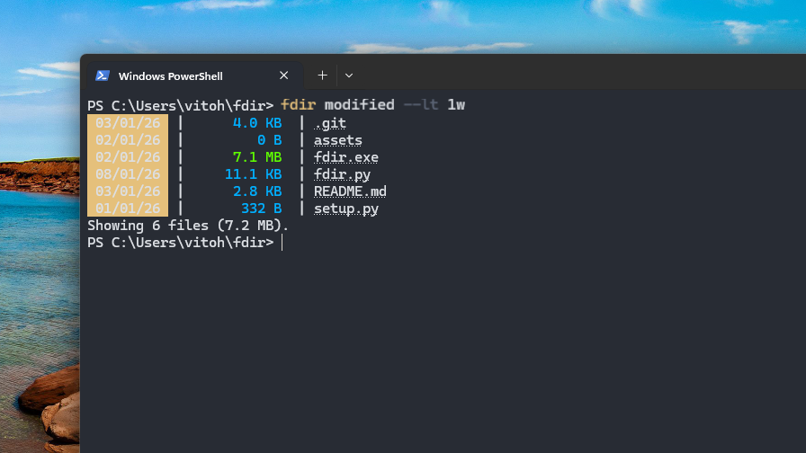

<h1 align="center">fdir</h1>


<p align="center">
  <i>Find and organize anything on your system</i>
</p>

<p align="center">
  
</p>

<p align="center">
  

  <a href="https://github.com/VG-dev1/fdir/releases">
    
  </a>

  

  <a href="https://github.com/VG-dev1/fdir/blob/main/LICENSE.md">
    
  </a>
</p>

---

## Features

- List all files and folders in the current directory
- Filter files by:
  - Last modified date (`--gt`, `--lt`)
  - File size (`--gt`, `--lt`)
  - Name keywords (`--keyword`, `--swith`, `--ewith`)
  - File type/extension (`--eq`)
- Sort results by:
  - Name, size, or modification date (`--order <field> <a|d>`)
- Use and/or
- Delete results (`--del`)
- Convert results to a different extension (`--convert`, available for the `type` operation)
- Search approximately (`--fuzzy`)
- Search the content of files
- Field highlighting in yellow (e.g. using the `modified` operation would highlight the printed dates)
  - With partial highlighting for the `name` operation
- Hyperlinks to open matching files
- Heatmap size field letter coloring (blue -> red)
- Add .fdirignore to your directory to make fdir ignore certain files, directories or extensions

## Examples

```bash
fdir modified --gt 1y --order name a  # Show files older than 1 year, in the ascending order by name
fdir size --lt 100MB --order modified d  # Show files smaller than 100MB, in the descending order by modified
fdir name --keyword report --order size a --deep  # Show files containing the "report" keyword, in the ascending order by size, and search recursively
fdir type --eq .wav --order name d --convert .mp3  # Show files with the ".wav" extension, in the descending order by name, and convert them to ".mp3"
fdir all --order modified a  # Show all files in the ascending order by modified
fdir modified --gt 1y or size --gt 1gb --del  # Show files older than 1 year old larger than 1GB, and delete them
```

## Usage

`fdir <operation> [options] [--order <field> <a|d>]`

#### Operations

| Operation | Flags | Description |
|----------|-------|-------------|
| `modified` | `--gt \| --lt <time>` | Filter files by last modified date |
| `size`     | `--gt \| --lt <size>` | Filter files by file size |
| `name`     | `--keyword \| --swith \| --ewith <pattern>` | Filter files by name |
| `type`     | `--eq <extension>` | Filter files by file extension |
| `all`      | — | List all files and directories |
| `version`  | — | Display the installed version of fdir
| `content`  | `--keyword <pattern>` | Search the content of textual files


#### Time Units (modified)

| Unit | Meaning |
|-----|--------|
| `h` | Hours |
| `d` | Days |
| `w` | Weeks |
| `m` | Months (approx. 30 days) |
| `y` | Years (approx. 365 days) |


#### Size Units (size)

| Unit | Meaning |
|-----|--------|
| `B`  | Bytes |
| `KB` | Kilobytes |
| `MB` | Megabytes |
| `GB` | Gigabytes |


#### Name Flags (name)

| Flag | Description |
|------|-------------|
| `--keyword` | Filename contains the pattern |
| `--swith` | Filename starts with the pattern |
| `--ewith` | Filename ends with the pattern |


#### Type Flags (type)

| Flag | Description |
|------|-------------|
| `--eq` | Match exact file extension (include the dot, e.g. `.py`) |


#### Additional flags

| Flag | Description |
|------|-------------|
| `--order` | Sort files in a specific order |
| `--deep`  | Search recursively |
| `--top`  | Print only the first certain amount of matches |
| `--fuzzy` | Search approximately (make fdir support typos) |


## Installation

### Windows

1. Download the "fdir.exe" file from the Releases tab.
2. Create a new folder in %USERPROFILE% on your computer.
3. Paste the downloaded "fdir.exe" file into that folder.
4. Copy the path of that folder.
5. Put the path of that folder into your system's PATH (run `setx PATH "%PATH%;C:\path\to\fdir_folder"` (replace the path with your actual path)).

### Linux

1. Download the "fdir" file from the Releases tab.
2. Go to the downloaded "fdir" file's folder (run `cd path/to/your/folder` (replace the path with your actual path)).
3. Copy that path into `~/.local/bin` (run `cp fdir ~/.local/bin`).

### MacOS

Sorry, not available yet.