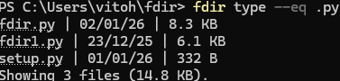

# fdir

**fdir** is a simple command-line utility to list, filter, and sort files and folders in your current directory. It provides a more flexible alternative to Windows's 'dir' command.

[](https://github.com/VG-dev1/fdir/releases)

---

## Features

- List all files and folders in the current directory
- Filter files by:
  - Last modified date (`--gt`, `--lt`)
  - File size (`--gt`, `--lt`)
  - Name keywords (`--keyword`, `--swith`, `--ewith`)
  - File type/extension (`--eq`)
- Sort results by:
  - Name, size, or modification date (`--order <field> <a|d>`)
- Use and/or
- Delete results (`--del`)
- Field highlighting in yellow (e.g. using the `modified` operation would highlight the printed dates)
- Hyperlinks to open matching files

## Demo



## Examples

```bash
fdir modified --gt 1y --order name a
fdir size --lt 100MB --order modified d
fdir name --keyword report --order size a
fdir type --eq .py --order name d
fdir all --order modified a
fdir modified --gt 1y or size --gt 1gb
```

## Usage

`fdir <operation> [options] [--order <field> <a|d>]`

#### Operations

| Operation | Flags | Description |
|----------|-------|-------------|
| `modified` | `--gt \| --lt <time>` | Filter files by last modified date |
| `size`     | `--gt \| --lt <size>` | Filter files by file size |
| `name`     | `--keyword \| --swith \| --ewith <pattern>` | Filter files by name |
| `type`     | `--eq <extension>` | Filter files by file extension |
| `all`      | — | List all files and directories |


#### Time Units (modified)

| Unit | Meaning |
|-----|--------|
| `h` | Hours |
| `d` | Days |
| `w` | Weeks |
| `m` | Months (approx. 30 days) |
| `y` | Years (approx. 365 days) |


#### Size Units (size)

| Unit | Meaning |
|-----|--------|
| `B`  | Bytes |
| `KB` | Kilobytes |
| `MB` | Megabytes |
| `GB` | Gigabytes |


#### Name Flags (name)

| Flag | Description |
|------|-------------|
| `--keyword` | Filename contains the pattern |
| `--swith` | Filename starts with the pattern |
| `--ewith` | Filename ends with the pattern |


#### Type Flags (type)

| Flag | Description |
|------|-------------|
| `--eq` | Match exact file extension (include the dot, e.g. `.py`) |


#### Optional Sorting

`--order <field> <a|d>`


## Installation

1. Download the "fdir.exe" file from the Releases tab.

2. Create a new folder in %USERPROFILE% on your computer.

3. Paste the downloaded "fdir.exe" file into that folder.

4. Copy the path of that folder.

5. Put the path of that folder into your system's PATH (run `setx PATH "%PATH%;C:\path\to\fdir_folder"` (replace the path with your actual path)).